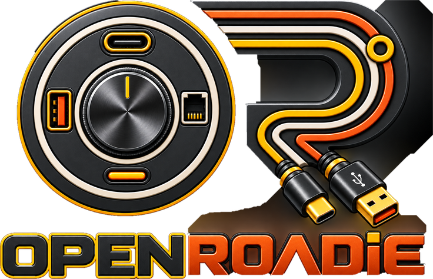

> [!WARNING]
> **OpenRoadie is under active development** and not yet stable — features and config may still change.

<h4 align="right"><strong>English</strong> | <a href="docs/README.zh-CN.md">简体中文</a> | <a href="docs/README.ja.md">日本語</a> | <a href="docs/README.de.md">Deutsch</a> | <a href="docs/README.fr.md">Français</a> | <a href="docs/README.ko.md">한국어</a></h4>

<p align="center">
    
</p>

<p align="center"><strong>⚡️ One local-first app for everything on your desk, written in Rust 🦀<br/>Logitech mice and keyboards over HID++, Elgato Stream Decks, QMK/VIA macro pads, any UVC webcam, monitors over DDC/CI, and Elgato Key Lights — no account, no telemetry</strong></p>

<p align="center">OpenRoadie is a fork of <a href="https://github.com/AprilNEA/OpenLogi">OpenLogi</a> by <a href="https://github.com/AprilNEA">@AprilNEA</a>, which provides the Logitech HID++ core, the GUI, the agent, and the packaging this project builds on.</p>

> **Fed up with Options+? Try OpenRoadie.**

Runs on macOS, Linux, and Windows.

---

## Beyond Options+

Things OpenRoadie does that Options+ won't:

- **Stay light.** Native Rust + GPUI.
- **Run on Linux.** Linux is a first-class platform in OpenRoadie.
- **Gestures on any button.** Give the gesture role to any physical button — or turn gestures off entirely.
- **Plain-text config.** Everything is one TOML file you can sync between machines however you like.
- **Script it.** A real CLI alongside the GUI.

## Features

- Devices connected over Logi Bolt receivers, Unifying receivers, Bluetooth, or a wired connection, with battery percentage and charge state
- Button remapping via the OS input hook: a built-in action catalog plus custom keyboard shortcuts authored in the TOML config, including independent short/long-press actions and hold-until-release chords for push-to-talk¹
- Per-application profile overlays that auto-switch on app focus (macOS + Windows; Linux on X11 / XWayland only)
- Litra lights: power, brightness, and color temperature, with optional auto power that follows camera activity

**Mouse**

- Capture and remap the middle, mode-shift, and thumbwheel buttons (middle everywhere, the rest where the device exposes them)
- Per-direction gesture bindings with live capture, on any capable button
- Actions Ring: a cursor-centred, eight-slot overlay of actions (`ShowActionsRing`), with per-application layouts
- DPI control with presets and Cycle / Set-preset actions (`0x2201`)
- SmartShift wheel: mode toggle, sensitivity, and a permanent-ratchet panel (`0x2111`)
- Per-device native scroll inversion (`0x2121`, supported devices)

**Keyboard**

- Global F-key remapping: the same action catalog as the mouse, plus power-user actions — typed text, key combos, multi-step workflows (macOS + Windows)
- Static RGB lighting (`0x8070` / `0x8080`, supported devices)

**Camera**

- Any Logitech UVC webcam (Brio, StreamCam, the C920 series, …), plug and play
- Live preview that opens the camera only while you watch — leaving it releases the camera entirely and the LED goes off
- Image controls written straight to the UVC hardware — zoom, focus, exposure, brightness, contrast, saturation, sharpness, white balance, tint, anti-flicker, and low-light compensation, with auto-mode toggles for focus / exposure / white balance — so changes apply in Meet / Zoom / OBS and every other app using the camera
- One-click profiles: built-in Default / Streaming / Video call plus custom snapshots; settings persist per camera and are written back to the hardware on the next view

**Monitor**

- Any monitor that speaks DDC/CI over its video cable — Dell, LG, Samsung, ASUS, BenQ, Gigabyte and most panels sold as a monitor rather than a TV
- Brightness, contrast, input source and volume, from the keyboard instead of the four unlabelled buttons on the bezel — which matters most for anyone who cannot read a menu the monitor draws itself
- The two writes that cannot be undone from the keyboard are refused unless you insist, and the refusal names the physical button you would otherwise have to find
- A laptop's own screen has no DDC channel and never appears

**Lights**

- Logitech Litra over USB, and Elgato Key Lights over the network, in one command and one list
- Power, brightness and colour temperature; Kelvin for both families, though an Elgato light actually counts in mireds and runs backwards
- Key Lights are found by asking the network, so nothing has to be written down when the router changes their address

¹ Media key actions use D-Bus MPRIS on Linux; a handful of macOS-specific actions have no universal Linux equivalent and are no-ops. Windows maps platform actions to native equivalents where available.

## Install

> [!IMPORTANT]
> Quit **Logi Options+** first: the two applications fight over HID++ access, and only one can own a given receiver at a time.

### macOS

Requires macOS 13 or later.

Download the signed, notarized `.dmg` from the [latest release](https://github.com/nadirthabatah/OpenRoadie/releases/latest) and drag `OpenRoadie.app` to `/Applications`.

There is no package-manager distribution under the OpenRoadie name yet;
the `.dmg` from this repository's releases is the install path. (Upstream
OpenLogi ships Homebrew casks, but those install OpenLogi, not this fork.)

### Linux

Download the package for your distribution from the
[latest release](https://github.com/nadirthabatah/OpenRoadie/releases/latest):

```sh
# Debian / Ubuntu
sudo dpkg -i roadie_*.deb

# Fedora / RHEL
sudo rpm -i roadie-*.rpm

# Arch Linux
sudo pacman -U roadie-*.pkg.tar.zst
```

Packages are published for both `x86_64`/`amd64` and `arm64`/`aarch64`.
Pre-built packages require GLIBC 2.35 or newer (Ubuntu 22.04 baseline).

NixOS users can instead import the repository's module, which installs the
package and udev rules and starts the agent with the graphical session:

```nix
{
  inputs.nixpkgs.url = "github:NixOS/nixpkgs/nixos-unstable";
  inputs.roadie = {
    url = "github:nadirthabatah/OpenRoadie";
    inputs.nixpkgs.follows = "nixpkgs";
  };

  outputs = { nixpkgs, roadie, ... }: {
    nixosConfigurations.my-host = nixpkgs.lib.nixosSystem {
      system = "x86_64-linux"; # or aarch64-linux
      modules = [
        roadie.nixosModules.default
        { programs.roadie.enable = true; }
      ];
    };
  };
}
```

All Linux packages install udev rules that grant your user access to
`/dev/hidraw*`, `/dev/uinput` and your Logitech mouse's `/dev/input/event*`
node without `sudo`. The NixOS module starts the agent automatically; after a
`.deb`, `.rpm`, or `.pkg.tar.zst` installation, enable it for your user:

```sh
systemctl --user enable --now roadie-agent.service
```

See [docs/INSTALL-linux.md](docs/INSTALL-linux.md) for complete NixOS options,
manual / source installs, and distros without systemd.

### Windows

Signed portable `.zip` archives and per-user `.msi` installers (x86_64 and
arm64) are attached to each release. Both ship the GUI (`OpenRoadie.exe`)
together with the background agent (`roadie-agent.exe`), which owns all
device I/O. Keep the two files side by side when using the portable zip, or
the GUI has nothing to connect to.

Windows support has been validated end-to-end on Windows 11 with real
hardware (a wired keyboard and a Unifying-receiver mouse), including
install, in-place upgrade, and uninstall of the MSI. It is newer than the
macOS build, so if you hit a rough edge please
[report it](https://github.com/nadirthabatah/OpenRoadie/issues). The agent shows a
system-tray icon (Show Main Window / Quit) so the app stays reachable after
the main window is closed. To disable it on Windows, set
`show_in_menu_bar = false` in the TOML `[app_settings]` block and restart the
agent; the GUI toggle is currently macOS-only.

To build from source, see [DEVELOPMENT.md](docs/DEVELOPMENT.md).


## Usage (CLI)

See [USAGE.md](docs/USAGE.md)

## Configuration

See [CONFIGURATION.md](docs/CONFIGURATION.md)

## Developing

See [DEVELOPMENT.md](docs/DEVELOPMENT.md)

## Acknowledgments

- **[OpenLogi](https://github.com/AprilNEA/OpenLogi)** by [@AprilNEA](https://github.com/AprilNEA) — OpenRoadie is a fork of OpenLogi; the HID++ engine, the GUI, the background agent, and the packaging all originate there
- **Windows, cameras, and i18n** by [@davidbudnick](https://github.com/davidbudnick) — keyboard RGB, Windows support, Logitech webcam support
- **Linux port** by [@cserby](https://github.com/cserby) — Linux support
- [Solaar](https://github.com/pwr-Solaar/Solaar) by [@pwr](https://github.com/pwr) — open-source HID++ implementation
- [Mouser](https://github.com/TomBadash/Mouser) by [@TomBadash](https://github.com/TomBadash) — a local, account-free Options+ replacement

## License

The code in this repository is dual-licensed under either of

- Apache License, Version 2.0 ([LICENSE-APACHE](LICENSE-APACHE))
- MIT license ([LICENSE-MIT](LICENSE-MIT))

at your option.

### Third-party code

`crates/roadie-hidpp` is a vendored fork of [`hidpp`](https://crates.io/crates/hidpp)
by [@lus](https://github.com/lus), licensed 0BSD.

### Logo & brand assets

The OpenRoadie logo and app icon (the artwork under [`design/`](design/)) are
© 2026 Nadir Thabatah, all rights reserved, and are not covered by the
MIT/Apache licenses above; see [`design/LICENSE`](design/LICENSE). Forking the
code grants no right to the OpenRoadie name, logo, or icon; please don't use
them to represent your own projects, forks, or distributions without prior
written permission.

None of this artwork derives from OpenLogi. OpenLogi's logo and icon set are
© AprilNEA, all rights reserved, and were removed from this repository rather
than renamed.

---

**Not affiliated with Logitech.** "Logitech", "MX Master", and "Options+" are trademarks of Logitech International S.A.
